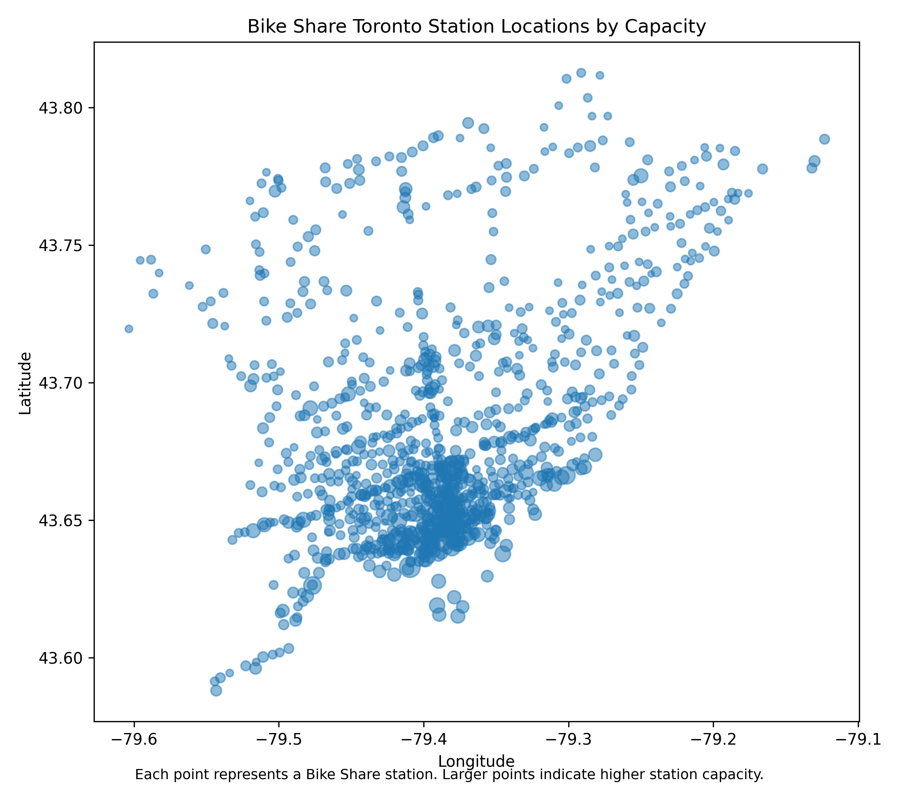

# Data Visualization

## Assignment 3: Final Project

### Requirements:
- We will finish this class by giving you the chance to use what you have learned in a practical context, by creating data visualizations from raw data. 
- Choose a dataset of interest from the [City of Toronto’s Open Data Portal](https://www.toronto.ca/city-government/data-research-maps/open-data/) or [Ontario’s Open Data Catalogue](https://data.ontario.ca/). 
- Using Python and one other data visualization software (Excel or free alternative, Tableau Public, any other tool you prefer), create two distinct visualizations from your dataset of choice.  
- For each visualization, describe and justify: 
# Visualization 1: Bike Share Toronto Station Locations by Capacity

Dataset: Bike Share Toronto GBFS station information  
Dataset link: https://toronto.publicbikesystem.net/customer/gbfs/v3.0/gbfs.json

## Software used

I created this visualization in Python using pandas and matplotlib. Python was useful because the dataset was available as a JSON feed, so I could download the data, clean the relevant columns, and generate the plot in one reproducible workflow.

## Intended audience

The intended audience is people interested in Toronto transportation planning, Bike Share Toronto users, students, and city staff who want a quick overview of where Bike Share stations are located and how station capacity varies across the city.

## Message of the visualization

This visualization shows that Bike Share Toronto stations are concentrated most heavily in the downtown core, with additional stations extending into surrounding neighbourhoods. The size of each point represents station capacity, so larger points indicate stations with more docking spaces. The visualization suggests that higher-capacity stations tend to appear in central and high-demand areas, while outer areas have fewer and more spread-out stations.

## Design choices

I used longitude and latitude as the x- and y-axes so that the plot roughly represents the geographic layout of Toronto. I used a scatter plot because each station is an individual location. Point size was mapped to station capacity, which makes the capacity information visible without needing a separate chart. I used transparency so overlapping points in dense downtown areas remain easier to see. I also included a clear title, axis labels, and a short caption explaining that larger points represent higher station capacity.

## Reproducibility

This visualization is reproducible because the full Python code is included in the notebook / Python file. The code downloads the raw data, selects the columns used in the visualization, cleans missing values, and saves both the cleaned CSV and final PNG. A limitation is that the Bike Share feed can update over time, so rerunning the code in the future may produce a slightly different map if stations are added, removed, or changed.

## Accessibility

I tried to make the visualization accessible by using a simple chart type, clear axis labels, a descriptive title, and a caption explaining the meaning of point size. The visualization does not rely only on colour; the main variable is represented by point size. For future improvement, I could add a basemap or labels for major areas of Toronto, but I kept the current version simple to avoid visual clutter.

## Impacted individuals and communities

This visualization could affect Bike Share users, commuters, tourists, cyclists, and communities that rely on public and active transportation. It may also be relevant to neighbourhoods that have fewer Bike Share stations or lower station capacity. Showing station distribution can support conversations about transportation access, but it can also oversimplify equity issues because station capacity alone does not show affordability, safety, road infrastructure, or actual ridership demand.

## Feature selection

I included station name, latitude, longitude, capacity, station ID, and charging station status in the cleaned dataset, but only latitude, longitude, and capacity were used in this visualization. I excluded fields such as rental methods, URLs, and other technical metadata because they were not necessary for showing the spatial distribution of stations.

## Underwater labour

The final plot required several steps that are not visible in the image itself: finding the correct GBFS data source, testing the API link, downloading the JSON data, converting it into a pandas DataFrame, checking column names, selecting useful variables, cleaning missing values, saving intermediate CSV files, adjusting plot size and point transparency, exporting the image, and checking that the visualization was readable.

- This assignment is intentionally open-ended - you are free to create static or dynamic data visualizations, maps, or whatever form of data visualization you think best communicates your information to your audience of choice! 
- Total word count should not exceed **(as a maximum) 1000 words** 
 
### Why am I doing this assignment?:  
- This ongoing assignment ensures active participation in the course, and assesses the learning outcomes: 
* Create and customize data visualizations from start to finish in Python
* Apply general design principles to create accessible and equitable data visualizations
* Use data visualization to tell a story  
- This would be a great project to include in your GitHub Portfolio – put in the effort to make it something worthy of showing prospective employers!

### Rubric:

| Component         | Scoring  | Requirement                                                                 |
|-------------------|----------|-----------------------------------------------------------------------------|
| Data Visualizations | Complete/Incomplete | - Data visualizations are distinct from each other - Data visualizations are clearly identified - Different sources/rationales (text with two images of data, if visualizations are labeled) - High-quality visuals (high resolution and clear data) - Data visualizations follow best practices of accessibility |
| Written Explanations | Complete/Incomplete | - All questions from assignment description are answered for each visualization - Explanations are supported by course content or scholarly sources, where needed |
| Code              | Complete/Incomplete | - All code is included as an appendix with your final submissions - Code is clearly commented and reproducible |

## Submission Information

🚨 **Please review our [Assignment Submission Guide](https://github.com/UofT-DSI/onboarding/blob/main/onboarding_documents/submissions.md)** 🚨 for detailed instructions on how to format, branch, and submit your work. Following these guidelines is crucial for your submissions to be evaluated correctly.

### Submission Parameters:
* Submission Due Date: `23:59 -  2026-06-16`
* The branch name for your repo should be: `assignment-3`
* What to submit for this assignment:
    * A folder/directory containing:
        * Two distinct data visualizations (for example, PNGs, PDFs, or screenshots)
        * Two Markdown files answering all questions for each visualization (including a link to your dataset in both files)
        * One Python file contains the complete code and visualization, and another file (with or without code) contains the visualization.
* What the pull request link should look like for this assignment: `https://github.com/<your_github_username>/visualization/pull/<pr_id>`
    * Open a private window in your browser. Copy and paste the link to your pull request into the address bar. Make sure you can see your pull request properly. This helps the technical facilitator and learning support staff review your submission easily.

Checklist:
- [ ] Create a branch called `assignment-3`.
- [ ] Ensure that the repository is public.
- [ ] Review [the PR description guidelines](https://github.com/UofT-DSI/onboarding/blob/main/onboarding_documents/submissions.md#guidelines-for-pull-request-descriptions) and adhere to them.
- [ ] Verify that the link is accessible in a private browser window.

If you encounter any difficulties or have questions, please don't hesitate to reach out to our team via our Slack. Our Technical Facilitators and Learning Support staff are here to help you navigate any challenges.
