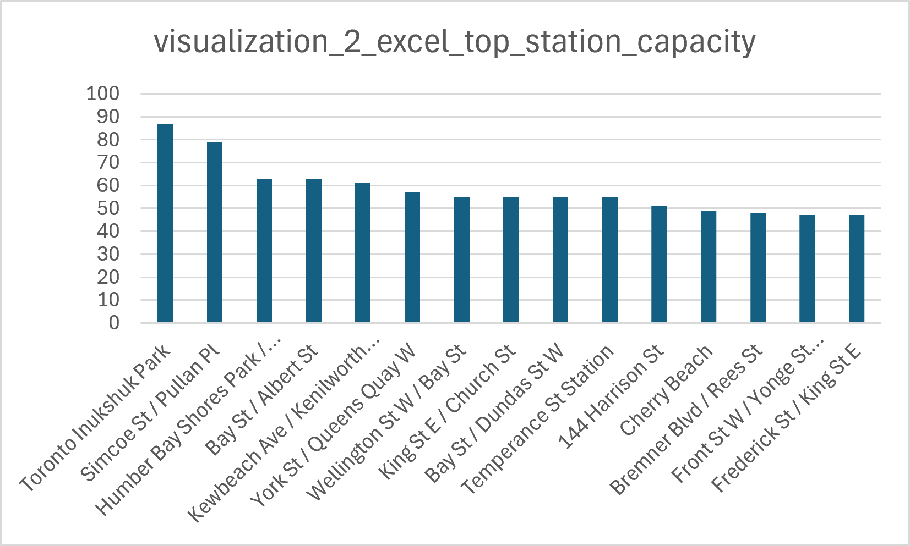

# Data Visualization

## Assignment 3: Final Project

### Requirements:
- We will finish this class by giving you the chance to use what you have learned in a practical context, by creating data visualizations from raw data. 
- Choose a dataset of interest from the [City of Toronto’s Open Data Portal](https://www.toronto.ca/city-government/data-research-maps/open-data/) or [Ontario’s Open Data Catalogue](https://data.ontario.ca/). 
- Using Python and one other data visualization software (Excel or free alternative, Tableau Public, any other tool you prefer), create two distinct visualizations from your dataset of choice.  
- For each visualization, describe and justify: 
# Visualization 2: Top 15 Bike Share Toronto Stations by Capacity

Dataset: Bike Share Toronto GBFS station information  
Dataset link: https://toronto.publicbikesystem.net/customer/gbfs/v3.0/gbfs.json

## Software used

I created this visualization using Microsoft Excel. 

## Intended audience

The intended audience is Bike Share Toronto users, city transportation staff, and general readers who want to quickly identify the largest Bike Share stations in Toronto.

## Message of the visualization

This bar chart shows the 15 Bike Share Toronto stations with the highest station capacity. Toronto Inukshuk Park has the largest capacity in this dataset, followed by Simcoe St / Pullan Pl. The chart makes it easy to compare the highest-capacity stations and see that a small group of stations have much larger capacity than typical stations.

## Design choices

I chose a bar chart because it is effective for comparing ranked categories. The stations are sorted from highest to lowest capacity, which helps the reader understand the ranking immediately. The y-axis shows station capacity, while the x-axis lists station names. I rotated the station labels so that longer names could fit on the chart. I used a consistent bar colour to avoid distracting from the main comparison.

## Reproducibility

The data preparation step is reproducible because the Python code creates the cleaned dataset and exports the top-capacity CSV file. The Excel chart itself is less reproducible than the Python visualization because some formatting choices, such as label rotation and chart styling, were adjusted manually. To reduce this issue, I saved the source CSV file and the final chart image. If the visualization needed to be fully reproducible, I would recreate the same bar chart in Python.

## Accessibility

I made the visualization accessible by using a familiar bar chart format, a clear y-axis scale, and station names directly on the x-axis. The chart does not require colour differences to interpret the data because capacity is shown by bar height. A possible improvement would be to shorten the title to “Top 15 Bike Share Toronto Stations by Capacity” and increase label spacing so long station names are easier to read.

## Impacted individuals and communities

This visualization could affect people who use large Bike Share stations, especially commuters, tourists, waterfront users, and residents near high-capacity areas. It may also influence how people think about which locations receive more cycling infrastructure. However, the visualization only shows capacity, so it should not be used alone to decide whether service is equitable. A smaller station may still be important to a local community.

## Feature selection

I included only station name and capacity because the purpose of this chart was to compare the largest stations. I excluded latitude, longitude, charging station status, and other metadata because they would make the chart less focused. I selected the top 15 stations rather than all stations because showing over 1,000 stations in one bar chart would be unreadable.

## Underwater labour

The final Excel chart required data cleaning and preparation before the chart could be made. This included downloading the station information, selecting the relevant columns, converting capacity values to numeric format, sorting stations by capacity, exporting the top 15 rows to CSV, importing the CSV into Excel, choosing an appropriate chart type, adjusting labels, checking the ranking, and exporting the chart as an image.

- This assignment is intentionally open-ended - you are free to create static or dynamic data visualizations, maps, or whatever form of data visualization you think best communicates your information to your audience of choice! 
- Total word count should not exceed **(as a maximum) 1000 words** 
 
### Why am I doing this assignment?:  
- This ongoing assignment ensures active participation in the course, and assesses the learning outcomes: 
* Create and customize data visualizations from start to finish in Python
* Apply general design principles to create accessible and equitable data visualizations
* Use data visualization to tell a story  
- This would be a great project to include in your GitHub Portfolio – put in the effort to make it something worthy of showing prospective employers!

### Rubric:

| Component         | Scoring  | Requirement                                                                 |
|-------------------|----------|-----------------------------------------------------------------------------|
| Data Visualizations | Complete/Incomplete | - Data visualizations are distinct from each other - Data visualizations are clearly identified - Different sources/rationales (text with two images of data, if visualizations are labeled) - High-quality visuals (high resolution and clear data) - Data visualizations follow best practices of accessibility |
| Written Explanations | Complete/Incomplete | - All questions from assignment description are answered for each visualization - Explanations are supported by course content or scholarly sources, where needed |
| Code              | Complete/Incomplete | - All code is included as an appendix with your final submissions - Code is clearly commented and reproducible |

## Submission Information

🚨 **Please review our [Assignment Submission Guide](https://github.com/UofT-DSI/onboarding/blob/main/onboarding_documents/submissions.md)** 🚨 for detailed instructions on how to format, branch, and submit your work. Following these guidelines is crucial for your submissions to be evaluated correctly.

### Submission Parameters:
* Submission Due Date: `23:59 -  2026-06-16`
* The branch name for your repo should be: `assignment-3`
* What to submit for this assignment:
    * A folder/directory containing:
        * Two distinct data visualizations (for example, PNGs, PDFs, or screenshots)
        * Two Markdown files answering all questions for each visualization (including a link to your dataset in both files)
        * One Python file contains the complete code and visualization, and another file (with or without code) contains the visualization.
* What the pull request link should look like for this assignment: `https://github.com/<your_github_username>/visualization/pull/<pr_id>`
    * Open a private window in your browser. Copy and paste the link to your pull request into the address bar. Make sure you can see your pull request properly. This helps the technical facilitator and learning support staff review your submission easily.

Checklist:
- [ ] Create a branch called `assignment-3`.
- [ ] Ensure that the repository is public.
- [ ] Review [the PR description guidelines](https://github.com/UofT-DSI/onboarding/blob/main/onboarding_documents/submissions.md#guidelines-for-pull-request-descriptions) and adhere to them.
- [ ] Verify that the link is accessible in a private browser window.

If you encounter any difficulties or have questions, please don't hesitate to reach out to our team via our Slack. Our Technical Facilitators and Learning Support staff are here to help you navigate any challenges.
